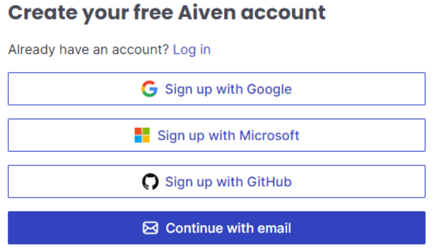
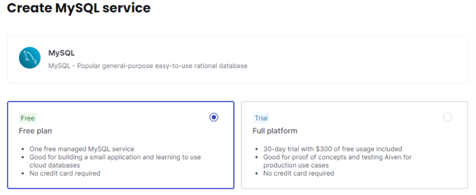

# Laravel Deploy (miniproject 14/2-24)

#### Se till att skriva ner stegen i en egen personlig guide/“att göra lista” för att få igång en deployment. Ha gärna med egna formuleringar och många egna bilder (eller video) så att ni enkelt kan följa er guide i framtiden.

<u>Hur du distribuerar (deploy) din Laravel- och MySQL-databas:</u>

Börja med att skapa ett konto på Aiven och Vercel enligt denna fil [Aiven and Vercel: get started](https://chasacademy.slack.com/files/U0275JGNM0X/F06JACVHP1D/aiven-vercel-laravel-deployment.pdf). Börja med Aiven. 
 
Nedan har du direktlänkar till respektive sida.

- [Aiven](www.aiven.io)
- [Vercel](www.vercel.com)
 

Om du arbetar i GitHub och har ett aktivt repository som du vill deploya, är rekommendationen att du skriver upp dig på hemsidan med ditt GitHub-konto. Välj "Sign up with GitHub".

När du har skapat ett konto i Aiven behöver du även skapa ditt första projekt som kommer att innehålla din första distribution. Efter att du har skapat ditt konto och projekt kommer att du skickas vidare till "Services", här skapar du en "New Service". Välj alternativet "MySQL services".

Nu kommer Aiven att efterfråga 

När du har skapat ett konto på Vercel, behöver du skapa ett projekt. Välj "MySQL" när du efterfrågas att skapa en "new service". Välj därefter "Free Plan". För att komma vidare  ska du sammankoppla det till ditt GitHub konto för att kunna importera ett repository som ska deployas.
  

